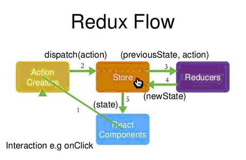

## 一、Redux框架

Redux是 Flux架构的体现，将 Flux 与函数式编程结合一起，很短时间内就成为了最热门的前端架构。


Redux是在解决中大型项目用到的框架，像Flux一样，小型项目可以不必使用。

> "如果你不知道是否需要 Redux，那就是不需要它。" ——someone
>
> "只有遇到 React 实在解决不了的问题，你才需要 Redux 。" —— Redux 的创造者 Dan Abramov


## 二、Redux设计思想

Redux 的设计思想很简单，就两句话。

（1）Web 应用是一个状态机，视图与状态是一一对应的。

（2）所有的状态，保存在一个对象里面。





如上图流程如下：

- `React Component`即我们通常说的视图，视图可能触发修改store的事件
- 修改store事件由`Action Creators`创建并通过store的dispatch方法，发送给store。
- store接收到action后，会发送给`Reducers`，发送给Reducers的有两个参数，一个是store本身，一个是action，然后Reducers拿到action对原来的store进行更新，然后返回新的store给store。
- 事先会在在视图加载后中绑定更新视图的函数，一旦store发生更新就会同步到视图。


## 三、示例

以商品列表页进行演示。

使用redux首先要安装redux模块。

```
npm i redux -S
```


### 1、创建store

```jsx
import { createStore } from 'redux';
import { reducer } from './reducer'

export let store = createStore(reducer);
```

### 2、在视图点击按钮发送action

```jsx
import {store} from './store'

add() {
    let action = {
        type: 'ADD_ITEM',
        goods: {name:'新商品'}
    }
    
    store.dispatch(action);
}
```


### 3、创建reducer，接收action

```jsx
import { deepCopy } from "./deepCopy"; // 自定义深拷贝函数

// 参数以：store中的state
// 参数二：store传过来的action
export let reducer = (state = {
    list: [
        { name: '商品1' },
        { name: '商品2' },
        { name: '商品3' },
    ]
}, action) => {
    let newStore = {};
    switch (action.type) {
        case 'ADD_ITEM':
            newStore = deepCopy(state);
            newStore.list.push(action.goods);
            return newStore;
            break;
        case 'DEL_ITEM':
            newStore = deepCopy(state);
            newStore.list.pop();
            return newStore;
            break;

        default:
            return state;
            break;
    }
}
```

state需要有初始值，即没有action修改的时候的初始值。也就是视图中不点击按钮时后显示的默认值。

既然要返回默认值，所以在default中，return state。

### 4、会事先在视图初始化时绑定视图更新函数

```jsx
import { List } from "./List";
import { store } from "./store";
import { addAction } from "./ActionCreators";

export class ListController extends React.Component{
    constructor(props){
        super(props)

        this.add = this.add.bind(this)
        this.updateView = this.updateView.bind(this)

        this.state = store.getState()
    }

    componentDidMount(){
        this.unsub = store.subscribe(this.updateView)
    }

    componentWillUnmount(){
        // 解绑视图更新函数
        this.unsub()
    }
	// 视图更新函数
    updateView(){
        this.setState(store.getState())
    }

    add(){
        store.dispatch(addAction({name:"新的商品"}))
    }

    render(){
        return <List list={this.state.list} add={this.add} />
    }
}
```


## 四、优化

### 1、封装action创建函数

发送的action一般会封装到一个函数中。

而action的type也会封装到一个单独的文件，避免重复。

```jsx
// actionCreators

import { ADD_ITEM, DEL_ITEM } from "./actionTypes";

export let addAction = (goods) => {
    return {
        type: ADD_ITEM,
        goods
    }
}

export let delAction = () => {
    return {
        type: DEL_ITEM
    }
}
```

```jsx
// actionTypes.js

export const ADD_ITEM = 'ADD_ITEM';
export const DEL_ITEM = 'DEL_ITEM';
```


于是我们的add函数就变成这样：

```jsx
import { addAction } from "./ActionCreators";

add(){
    store.dispatch(addAction({name:"新的商品"}))
}
```


### 2、自动创建容器组件

我门之前容器组件和UI组件都是自己创建的，现在react提供了专门的插件，方便我们创建容器组件。

> 而且由于创建的容器组件代码量小，所以可以将UI组件和容器组件合并成一个文件。

安装插件：

```
npm i react-redux -S
```

组件代码：

```jsx
// Goods.js
import { connect } from "react-redux";
import { addAction, delAction } from "../actionCreators";

// 1、容器部分

// 此函数放容器的state
let mapStateToProps = (state) => {
    return {
        list: state.list
    }
}
// 此函数放容器的一些方法
let mapDispatchToProps = dispatch => {
    return {
        add() {
            let name = this.refs.goodsInput.value;
            let action = addAction({ name });

            dispatch(action);
        },
        del() {
            let action = delAction();

            dispatch(action);
        }
    }
}

// 最后导入UI中的Goods,Goods来自UI
export let GoodsController = connect(mapStateToProps, mapDispatchToProps)(Goods);

/*——————————————————————————————————容器，UI分界线————————————————————————————————————————*/

// 2、UI部分
export class Goods extends React.Component {
    constructor() {
        super();
    }

    render() {
        let { list } = this.props;
        let domList = list.map((item, i) => {
            return (
                <li key={i}>{item.name}</li>
            );
        });
        return (
            <div>
                商品名：<input type="text" ref="goodsInput" />
                <button onClick={this.props.add.bind(this)}>添加</button>
                <button onClick={this.props.del}>删除</button>
                <ul>
                    {domList}
                </ul>
            </div>
        );
    }
}
```

上面代码，前一部分是容器，后一部分是UI（**UI组件是不用暴露出去的**），分界还是很明显的。

最后需要注意的是，**整个应用**需要最外面包裹一层`Provider`才可以，还要传一个store参数过去：

```jsx
import { render } from 'react-dom';
import { GoodsController } from './Goods';
import { Provider } from "react-redux";
import { store } from "./store";

render(<Provider store={store}><GoodsController /></Provider>, document.getElementById('app'));
```


> 注意：自动创建的容器组件不需要绑定视图更新函数。


### 3、reducer拆分

我们之前的reducer长下面这样，只有一个Goods组件：

```jsx
import { deepCopy } from "./deepCopy";

export let reducer = (state = {
    list: [
        { name: '商品1' },
        { name: '商品2' },
        { name: '商品3' },
    ]
}, action) => {
    let newStore = {};
    switch (action.type) {
        case 'ADD_ITEM':
            newStore = deepCopy(state);
            newStore.list.push(action.goods);
            return newStore;
            break;
        case 'DEL_ITEM':
            newStore = deepCopy(state);
            newStore.list.pop();
            return newStore;
            break;

        default:
            return state;
            break;
    }
}
```

如果组件一多，所有的store的初始state就会积压在一起不方便管理，所以要进行拆分。

比如增加一个Home组件，Home组件有title和banner列表，那么我就要写在一起：

```jsx
import { deepCopy } from "../deepCopy";

export let reducer = (state = {
    list: [
        { name: '商品1' },
        { name: '商品2' },
        { name: '商品3' },
    ],
    title: '首页',
    banner: [
        { name: '首页1' },
        { name: '首页2' },
        { name: '首页3' },
    ]
}, action) => {
    let newStore = deepCopy(state);;
    switch (action.type) {
        case 'ADD_ITEM':
            newStore.list.push(action.goods);
            return newStore;

        case 'DEL_ITEM':
            newStore.list.pop();
            return newStore;

        default:
            return state;
    }
}
```

如果有更多组件的话就更乱了。

拆分成`homeReducer.js`和`goodsReducer.js`，最后合并到`index.js`

```jsx
// homeReducer.js
export let homeReducer = (state = {
    title: '首页',
    banner: [
        { name: '首页1' },
        { name: '首页2' },
        { name: '首页3' },
    ]
}, action) => {
    return state;
}
```

```jsx
// goodsReducer.js
import { deepCopy } from "../deepCopy";

export let goodsReducer = (state = {
    list: [
        { name: '商品1' },
        { name: '商品2' },
        { name: '商品3' },
    ],
}, action) => {
    let newStore = deepCopy(state);;
    switch (action.type) {
        case 'ADD_ITEM':
            newStore.list.push(action.goods);
            return newStore;

        case 'DEL_ITEM':
            newStore.list.pop();
            return newStore;

        default:
            return state;
    }
}
```

合并的时候需要用到一个来自redux的插件`combineReducers`：

```jsx
import { combineReducers } from "redux";
import { homeReducer } from "./homeReducer";
import { goodsReducer } from "./goodsReducer";

export let reducer = combineReducers({
    home: homeReducer,
    goods: goodsReducer
});
```


### 4、异步action

> 注意：
>
> 我们创建action的函数actionCreators中的代码必须是纯函数，也必须是同步函数，有点类似与mutations。

那么如果有异步的代码怎么办？比如ajax获取数据？

这时候需要用到`redux-thunk`安装插件。


1、安装插件

```
npm i redux-thunk -S
```

2、修改store

applyMiddleware 是中间件的意思。

```jsx
import { createStore, applyMiddleware } from 'redux';
import { reducer } from './reducers'
import thunk from "redux-thunk";

export let store = createStore(reducer, applyMiddleware(thunk));
```

这个时候，我们store的dispatch的action就可以不是对象了，可以是个函数类型，如果是函数类型的话，dispatch这个函数，会使得这个函数立即执行。

然后一般这个函数就是用来异步请求数据的，在这个函数请求到数据的时候才会在这个函数内部再次dispatch得到的数据，这个数据就是一个对象。有点像绕弯的样子。

我们就在Home页请求商品列表：

Home.js 容器加UI组件：

```jsx

import { connect } from "react-redux";
import { getListAction } from "./actionCreators";

// UI组件
class UI extends React.Component {
    constructor() {
        super();
    }

    componentDidMount() {
        // UI加载完成就获取ajax信息
        this.props.getList();
    }

    render() {
        let { title, banner } = this.props;
        let domList = banner.map((item, i) => {
            return (
                <li key={i}>{item._id}</li>
            );
        });
        return (
            <div>
                <h1>{title}</h1>
                <ul>{domList}</ul>
            </div>
        );
    }
}

let mapStateToProps = (state) => {
    // 注意：由于拆分了reducer，所以state相应的也改变了。
    // 就不是之前的state.title和state.banner了
    return {
        title: state.home.title,
        banner: state.home.banner
    }
}

let mapDispatchToProps = dispatch => {
    return {
        getList() {
            // getListAction是一个异步函数，用来获取ajax数据
            dispatch(getListAction);
        }
    }
}

export let Home = connect(mapStateToProps, mapDispatchToProps)(UI);
```


创建actionCreators.js函数：异步请求ajax数据，并发给homeReducer

```jsx
import { BANNER_ITEM } from "./actionTypes";
import axios from 'axios';

export let setListAction = (banner) => {
    return {
        type: BANNER_ITEM,
        banner
    }
}

// getListAction有一个参数就是mapDispatchToProps的参数dispatch，用来发送action
export let getListAction = dispatch => {
    axios.get("/zhuiszhu/goods/getHot")
        .then(({ data }) => {
            // 获取到数据后，将action对象发送给homeReducer
            dispatch(setListAction(data.list));
        })
}
```


homeReducer接收数据，更新homeState：

```jsx
import { BANNER_ITEM } from "../actionTypes";
import { deepCopy } from "../deepCopy";

export let homeReducer = (state = {
    title: '首页',
    banner: []
}, action) => {
    let newState = deepCopy(state);
    switch (action.type) {
        case BANNER_ITEM:
            newState.banner = action.banner;
            return newState;

        default:
            return state;
    }
}
```


自动创建的容器组件会自动更新视图。


我们知道store的dispatch的action在异步的时候是个函数类型，如果我们要获取商品详情的话，必然会在类似下面代码的getListAction函数中传入参数，一旦传入参数，就不是函数类型了，类型是函数的返回值。所以我们应该在getListAction中返回一个函数类型。

```jsx
let mapDispatchToProps = dispatch => {
    return {
        getList() {
            // getListAction是一个异步函数，用来获取ajax数据
            dispatch(getListAction(id));
        }
    }
}
```

类似下面的伪代码：

```jsx
export let getListAction = dispatch => {
    // 返回的是个函数
    return dispatch => {
        axios.get("/zhuiszhu/goods/getHot",{parems:{xxx}})
        .then(({ data }) => {
            dispatch(xxx);
        })
    }
}
```


## 五、简易redux项目

包括首页，商品列表，详情页和页面。

有道云笔记链接：http://note.youdao.com/noteshare?id=e6b82f2de0baa14e7e4be059c1143581&sub=C3F7D4882A2F4F8F9F400EFDC4AE5CC9


