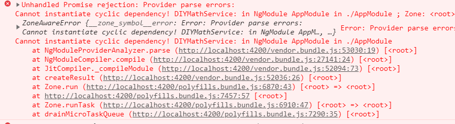

## 一、接口

js中类的接口定义：

```typescript
interface Human {
    run();
    eat();
}
```

> 接口的方法没有方法体。
>
> 实现接口的类，必须实现接口中的所有方法。


## 二、依赖注入(服务)

依赖注入就是自己创建一个服务（服务的本质就是一个类），然后在使用类的时候，不需要自己new类的实例，只需要按照特定的方式注入，类的实例就会被自动创建，然后直接使用即可。


### 1、创建服务

```js
ng g service services/DIYMath  // ng g s services/DIYMath
```

创建的时候会有个警告`WARNING Service is generated but not provided, it must be provided to be used` 未引入服务，后面注意引入。


### 2、实现服务逻辑代码

```typescript
import { Injectable } from '@angular/core';

// 服务装饰器
// 作用：此服务可以再调用别的服务
@Injectable()
export class DIYMathService {

  // 如果调用别的服务
  constructor(private xxx:newDIYMath) { }

  // 加
  add(a: number, b: number): number {
    return a * 1 + b * 1;
  }
  // 减
  reduce(a: number, b: number): number {
    return a * 1 - b * 1;
  }
}

```


### 3、在主模块中注入服务

```typescript
// app.module.ts

providers: [DIYMathService],
```

> 如果未在主模块中注入服务的话，会报`DI Error` 错误。


### 4、在组件中使用服务

```typescript
// a.component.ts

import { DIYMathService } from 'app/services/diymath.service';

export class AComponent implements OnInit {

  constructor(
    // 使用DIYMathService服务
    private dm: DIYMathService
  ) { }

  a: number = 0;
  b: number = 0;
  alg: string = '+';
  result: number = 0;

  opt() {
    this.result = this.dm[this.alg](this.a, this.b);
  }

  ngOnInit() {
  }

}
```

```html
<!-- a.component.html -->

<div>
    <input type="text" [(ngModel)]="a">
    <select (change)="opt()" [(ngModel)]="alg">
        <option value="add">+</option>
        <option value="reduce">-</option>
    </select>
    <input type="text" [(ngModel)]="b">
    = <span>{{result}}</span>
</div>
```


### 5、Tips

如果此时我们的项目有很多地方使用了DIYMathService服务，但是我们又创建了一个新的服务NewDIYMathService，它比DIYMathService要好，所以我们像将项目中所有的DIYMathService替换成NewDIYMathService，怎么替换？一个个手改？

不需要，只需要在注入主模块的时候，**挂羊头卖狗肉**即可：

```
将 
providers: [DIYMathService],
改为：
providers: [{ provide: DIYMathService, useClass: NewDIYMathService }],
```

> 其实`providers: [DIYMathService]`
>
> 就相当于`providers: [{ provide: DIYMathService, useClass: DIYMathService}]`


> 注意：如果挂羊头卖狗肉，那么在狗肉的服务里面不能引入羊头服务，否则报错！

也就是下面的写法报错：

```typescript
import { Injectable } from '@angular/core';
import { DIYMathService } from './diymath.service';

@Injectable()
// 狗肉
export class NewDIYMathService {
  // 引入羊头
  constructor(public dm: DIYMathService) { }
  // ...
}
```




## 三、http代理

由于angular没有使用webpack，所以http代理的配置和之前的不同。

如何设置http代理？

1、新建http代理文件（⚠ **文件存放在项目根目录下**）

```json
// proxy.config.json

{
    "/zhuiszhu": {
        "target": "http://www.projectlog.top:3000"
    }
}
```


2、添加到项目启动中

```json
// package.json

"scripts": {
    "start": "ng serve --proxy-config proxy.config.json",
},
```

> 💡 记得要重启服务哦！


3、发起http请求

angular有内置的http请求服务，只需要注入即可使用。

```js
import { Http } from '@angular/http';

export class HomeComponent implements OnInit {

    // 注入使用Http服务
  constructor(private http: Http) { }

  ngOnInit() {
      // 发起ajax请求
    this.http.get('/zhuiszhu/goods/getList').subscribe(res => {
        // res.json()可以获取的想要的数据
      console.log(res.json());
    })
  }
}
```


