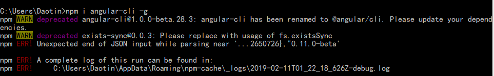
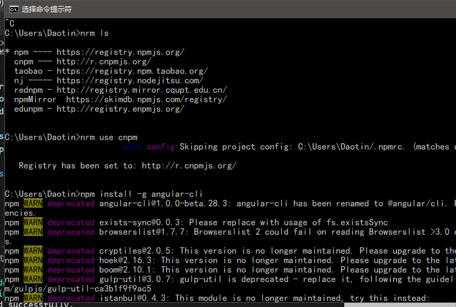
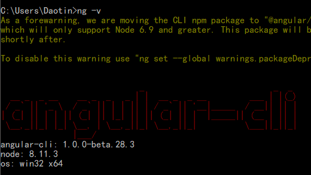
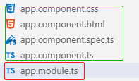
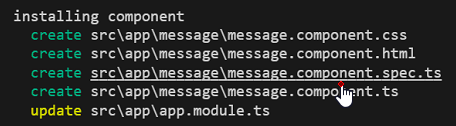

## 一、Angular简介

### 1、什么是 Angular？

Angular 是一个开发平台。它能帮你更轻松的构建 Web 应用。Angular 集声明式模板、依赖注入、端到端工具和一些最佳实践于一身，为你解决开发方面的各种挑战。Angular 为开发者提升构建 Web、手机或桌面应用的能力。


### 2、Angular代码整体架构

Angular项目是由一个个模块组成。

**并且至少会有一个主模块，其他的模块在使用的时候，需要导入到主模块中使用。**

一个模块中只要包含三个部分：

- **组件 component：主要是显示视图的html**
- **管道 pipe：类似于过滤器的功能**
- **服务 server：用于封装业务逻辑代码**


## 二、第一个Angular项目

创建Angular项目使用Angular脚手架。

### 1、安装Angular脚手架：

```
npm i angular-cli -g
```

> 注意：有时候安装总是失败，npm不能使用淘宝镜像。



切换npm镜像到cnpm：



验证Angular-cli版本：

```
ng -v
```

如下图显示则为安装成功：




### 2、创建angular项目

在存放angular项目的文件夹下使用命令：

```
ng new firstAngular
```


看下app文件夹：



我们之前说过，一个angular项目至少要有一个主模块，app.module.ts就是主模块。上面的四个文件就是主模块中的一个组件。


```typescript
/*app.module.ts*/

import { BrowserModule } from '@angular/platform-browser';
import { NgModule } from '@angular/core';
import { FormsModule } from '@angular/forms';
import { HttpModule } from '@angular/http';

import { AppComponent } from './app.component';
// 模块装饰器
// 元数据装饰器
@NgModule({
  declarations: [ //用于注册(挂载)当前模块中的组件或者管道
    AppComponent//主组件
  ],
  imports: [ //用于引入别的模块
    BrowserModule,
    FormsModule,
    HttpModule
  ],
  providers: [], //提供器 用于挂载服务server
  bootstrap: [AppComponent] // 启动的是主组件
})
export class AppModule { }
```


Component主组件

```typescript
import { Component } from '@angular/core';

@Component({
  selector: 'app-root', //声明组件名
  templateUrl: './app.component.html', //声明模板文件
  styleUrls: ['./app.component.css'] //声明需要使用到的样式文件
})
export class AppComponent {
  // stage-2 语法
  title = 'app works!';
  
  // stage-2 语法 与下面等价
  // constructor(){
  //   this.title = "app.works"
  // }
}
```


## 三、angular组件

### 1、创建组件

```js
ng g component Message // 简写 ng g c Message
```




> 创建类：
>
> ```
> ng g class Box // 简写 ng g cl Box
> ```


### 2、使用Message组件

在主组件Component中使用Message组件：


> 注意：
>
> 1、angualr可以有多个顶层元素。
>
> 2、angular组件的调用必须使用双标签。


在组件中，数据不需要写在state中，可以只写写在类中。

像主组件,title直接写在AppComponent中：

```typescript
export class AppComponent {
  title = 'app works!';
}
```

> 注意：
>
>  `title = 'app works!';`的写法是ES6的stage-2的语法，它原来的写法是这样的：
>
> `constructor() {
>     this.title = 'app works!';
>   }` 
>
> 两者的写法等价。


## 四、typescript

我们发现，项目中所有的js文件全部替换成了ts文件。

**ts文件就是Typescript的缩写，Typescript是JavaScript语言的超集，类似于jsx于js的关系，是对js的进一步封装，扩展，优化等。**


下面是几个常见的特性：

### 1、变量的类型验证

typescript的变量可以直接对其类型进行限定。

语法：

```
变量名 : 类型
```

示例：定义一个Box类。

```typescript
export class Box {
    constructor(username: string, age: number) {
        this.username = username;
        this.age = age;
    }
}
```

类型验证可以加在任何地方：

`let user: Box = new Box('Daotin', 20);`

限定user为Box类型，如果user赋值时不是Box类型，则报错。


**泛型：**

```typescript
list: Array<Box> = [
    new Box('Daotin', 20),
    new Box('Daotin', 20),
    new Box('Daotin', 20),
    new Box('Daotin', 20),
  ];
```

类型验证时，如果是数组，数组中的每个元素也需要验证的话，需要使用`<>`来表示，这种方式叫做泛型。


### 2、修饰符

在类中声明的变量还可以用`public`，`private`进行访问限制。

```typescript
export class Box {
    constructor(public username: string, private age: number) {
        this.username = username;
        this.age = age;
    }

    sayHi() {
        console.log(this.age);
    }
}

let box: Box = new Box('aaa', 11);

box.sayHi(); // 私有属性只能类内部访问
console.log(box.username); // 公有属性可以外部访问
```

当存在修饰符的时候，上面的constructor类似于：

```typescript
constructor(public username: string, private age: number) {
    // this.username = username;
    // this.age = age;
}
```

形参会自动转为实参，并且自动挂载到实例上，可以直接使用。


