## 一、canvas


通过JS完成画图而不是css

canvas 默认 inline-block，可以认为是一种特殊的图片。


### 1、canvas 划线

```html
<canvas id="can" width="800" height="800"></canvas>
```

> （宽高不能放在style里面，否则比例不对）
>
> canvas里面的width和height相当于图片的原始尺寸，加了外部style的宽高，就相当于对图片进行压缩和拉伸。

```js
// 1、获取原生dom对象
let dom = document.getElementById('can');

// 2、获取绘图对象
let can = dom.getContext('2d'); // 3d是webgl

// 定义线条起点
can.moveTo(0,0);

// 定义线条中点（非终点）
can.lineTo(400,400);
can.lineTo(800,0);

// 对标记范围进行描边
can.stroke()

// 对标记范围进行填充
can.fill();
```

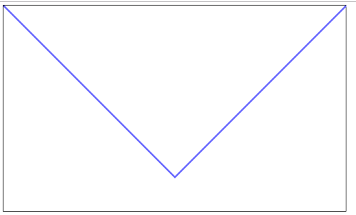


### 2、设置线条属性

线条默认宽度是1.

> （一定要在绘图之前设置。）

```js
can.lineWidth = 2; //设置线条宽度
can.strokeStyle = '#f00';  // 设置线条颜色

can.fillStyle = '#f00';  // 设置填充区域颜色
```


### 3、折线样式

- `miter`：尖角（当尖角长度值过长时会自动变成折角，如果强制显示尖角：`can.miterLimit = 100`设置尖角长度阈值）

- `round`：圆角
- `bevel`：折角

```js
can.lineJoin = 'miter';
can.moveTo(100, 100);
can.lineTo(300, 100);
can.lineTo(100, 200);
can.stroke()

can.lineJoin = 'round';
can.moveTo(400, 100);
can.lineTo(600, 100);
can.lineTo(400, 200);
can.stroke()

can.lineJoin = 'bevel';
can.moveTo(700, 100);
can.lineTo(900, 100);
can.lineTo(700, 200);
can.stroke()
```

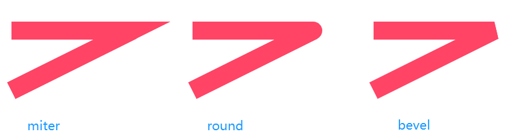


### 4、设置线帽

- `round`：加圆角线帽
- `square`：加直角线帽
- `butt`：不加线帽

```js
	can.lineCap = 'round';
    can.moveTo(100, 100);
    can.lineTo(300, 100);
	can.stroke()
	
     // 新建绘图，使得上一次的绘画样式不会影响下面的绘画样式（代码加在上一次绘画和下一次绘画中间。）
	can.beginPath()
	
	can.lineCap = 'square';
	can.moveTo(100, 200);
	can.lineTo(300, 200);
	can.stroke()
	
	can.beginPath()
	
	can.lineCap = 'butt';
	can.moveTo(100, 300);
	can.lineTo(300, 300);
```

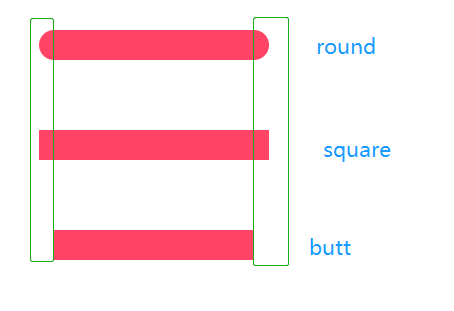

### 5、画矩形

```js
// 参数：x,y,宽，高

can.rect(100,100,100,100);
can.stroke();
```

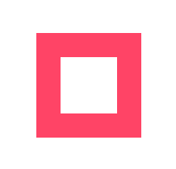

```js
// 画完即填充
can.fillRect(100,100,100,100);
```

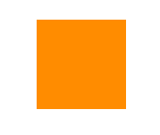

### 6、画圆弧

```js
// 参数：圆心x，圆心y，半径，圆弧起点与圆心的夹角度数，圆弧终点与圆心的夹角度数，true（逆时针绘画）

can.arc(500,300,200,0,2*Math.PI/360*90,false);
can.stroke()
```

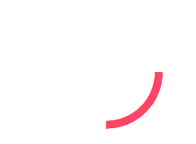

示例：

```js
can.moveTo(500,300);
can.lineTo(500 + Math.sqrt(100), 300 + Math.sqrt(100))
can.arc(500, 300, 100, 2 * Math.PI / 360 *startDeg, 2 * Math.PI / 360 *endDeg, false);
can.closePath()//将图形起点和终点用线连接起来使之成为封闭的图形
can.fill()
```

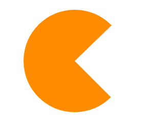


> 1、`can.beginPath()` // 新建绘图，使得上一次的绘画样式不会影响下面的绘画样式（代码加在上一次绘画和下一次绘画中间。）
>
> 2、`can.closePath()` //将图形起点和终点用线连接起来使之成为封闭的图形。


### 7、旋转画布

```js
can.rotate(2*Math.PI/360*45); // 一定要写在开始绘图之前
can.fillRect(0,0,200, 10);
```

> 旋转整个画布的坐标系（参考坐标为画布的(0,0)位置）

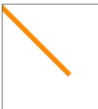


### 8、缩放画布

```js
can.scale(0.5,2);
can.fillRect(0,0,200, 10);
```

**整个画布**：x方向缩放为原来的0.5，y方向拉伸为原来的2倍。

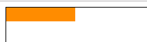


### 9、画布位移

```js
can.translate(100,100)
can.fillRect(0,0,200, 10);
```

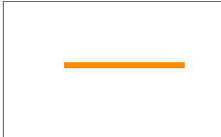


### 10、保存与恢复画布状态

```js
can.save() // 存档：保存当前画布坐标系状态
can.restore() // 读档：恢复之前保存的画布坐标系状态
```

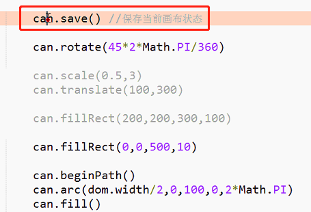

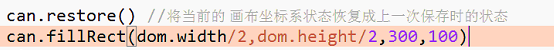


### 11、示例1：指针时钟

```html
<!DOCTYPE html>
<html>

<head>
    <meta charset="utf-8">
    <title>clock</title>
    <style type="text/css">
        #can {
            width: 1000px;
            height: 600px;
            background: linear-gradient(45deg, green, skyblue);
        }
    </style>
</head>

<body>
    <canvas id="can" width="2000" height="1200"></canvas>
</body>

<script type="text/javascript">
    let dom = document.getElementById('can');

    let can = dom.getContext('2d');

    // 把画布的圆心移动到画布的中心
    can.translate(dom.width / 2, dom.height / 2);
    // 保存当前的画布坐标系
    can.save()


    run();


    function run() {
        setInterval(function() {
            clearCanvas();
            draw();
        }, 10);
    }

    // 绘图
    function draw() {
        let time = new Date();
        let hour = time.getHours();
        let min = time.getMinutes();
        let sec = time.getSeconds();
        let minSec = time.getMilliseconds();

        drawPannl();
        drawHour(hour, min, sec);
        drawMin(min, sec);
        drawSec(sec, minSec);
        drawPoint();
    }

    // 最简单的方法：由于canvas每当高度或宽度被重设时，画布内容就会被清空
    function clearCanvas() {
        dom.height = dom.height;
        can.translate(dom.width / 2, dom.height / 2);
        can.save()
    }

    // 画表盘
    function drawPannl() {
        can.beginPath();

        can.restore()
        can.save()

        can.lineWidth = 10;
        can.strokeStyle = 'skyblue';
        can.arc(0, 0, 400, 0, 2 * Math.PI);
        can.stroke();

        for (let i = 0; i < 12; i++) {
            can.beginPath();
            can.lineWidth = 16;
            can.strokeStyle = 'greenyellow';

            can.rotate(2 * Math.PI / 12)

            can.moveTo(0, -395);
            can.lineTo(0, -340);
            can.stroke();
        }

        for (let i = 0; i < 60; i++) {
            can.beginPath();
            can.lineWidth = 10;
            can.strokeStyle = '#fff';

            can.rotate(2 * Math.PI / 60)

            can.moveTo(0, -395);
            can.lineTo(0, -370);
            can.stroke();
        }
    }

    // 画时针
    function drawHour(h, m, s) {
        can.beginPath();

        can.restore()
        can.save()

        can.lineWidth = 24;
        can.strokeStyle = 'palevioletred';
        can.lineCap = 'round'
        can.rotate(2 * Math.PI / (12 * 60 * 60) * (h * 60 * 60 + m * 60 + s))
        can.moveTo(0, 0);
        can.lineTo(0, -200);
        can.stroke();
    }

    // 画分针
    function drawMin(m, s) {
        can.beginPath();

        can.restore()
        can.save()

        can.lineWidth = 14;
        can.strokeStyle = '#09f';
        can.lineCap = 'round'
        can.rotate(2 * Math.PI / (60 * 60) * (m * 60 + s))
        can.moveTo(0, 0);
        can.lineTo(0, -260);
        can.stroke();
    }

    // 画秒针
    function drawSec(s, ms) {
        can.beginPath();

        can.restore()
        can.save()

        can.lineWidth = 8;
        can.strokeStyle = '#f00';
        can.lineCap = 'round'
        can.rotate(2 * Math.PI / (60 * 1000) * (s * 1000 + ms));
        can.moveTo(0, 50);
        can.lineTo(0, -320);
        can.stroke();
    }


    // 画中心点
    function drawPoint() {
        can.beginPath();

        can.restore()
        can.save()

        can.lineWidth = 10;
        can.fillStyle = 'red';
        can.arc(0, 0, 12, 0, 2 * Math.PI);
        can.fill();
    }
</script>

</html>
```

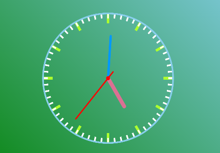


### 12、示例2：圆弧时钟

```html
<!DOCTYPE html>
<html>

<head>
    <meta charset="utf-8">
    <title>clock</title>
    <style type="text/css">
        #can {
            width: 1000px;
            height: 600px;
            background: linear-gradient(45deg, rgb(94, 53, 6), black);
        }
    </style>
</head>

<body>
    <canvas id="can" width="2000" height="1200"></canvas>
</body>

<script type="text/javascript">
    let dom = document.getElementById('can');

    let can = dom.getContext('2d');

    // 把画布的圆心移动到画布的中心
    can.translate(dom.width / 2, dom.height / 2);
    // 保存当前的画布坐标系
    can.save();

    // 圆形指针起始角度
    let startDeg = 2 * Math.PI / 360 * 270;


    run();
    // draw();


    function run() {
        setInterval(function() {
            clearCanvas();
            draw();
        }, 20);
    }

    // 绘图
    function draw() {
        let time = new Date();
        // let hour = time.getHours();
        let hour = time.getHours() > 10 ? time.getHours() - 12 : time.getHours();
        let min = time.getMinutes();
        let sec = time.getSeconds();
        let minSec = time.getMilliseconds();

        drawPannl();
        drawTime(hour, min, sec, minSec);
        drawHour(hour, min, sec);
        drawMin(min, sec);
        drawSec(sec, minSec);
        drawPoint();
    }

    // 最简单的方法：由于canvas每当高度或宽度被重设时，画布内容就会被清空
    function clearCanvas() {
        dom.height = dom.height;
        can.translate(dom.width / 2, dom.height / 2);
        can.save()
    }

    // 画表盘
    function drawPannl() {

        can.restore()
        can.save()

        // 设置时表盘
        can.beginPath();
        can.lineWidth = 50;
        can.strokeStyle = 'rgba(255,23,87,0.2)';
        can.arc(0, 0, 400, 0, 2 * Math.PI);
        can.stroke();
        // 设置分表盘
        can.beginPath();
        can.strokeStyle = 'rgba(169,242,15,0.2)';
        can.arc(0, 0, 345, 0, 2 * Math.PI);
        can.stroke();
        // 设置秒表盘
        can.beginPath();
        can.strokeStyle = 'rgba(21,202,230,0.2)';
        can.arc(0, 0, 290, 0, 2 * Math.PI);
        can.stroke();


        // 小时刻度
        // for (let i = 0; i < 12; i++) {
        //     can.beginPath();
        //     can.lineWidth = 16;
        //     can.strokeStyle = 'rgba(0,0,0,0.2)';

        //     can.rotate(2 * Math.PI / 12)

        //     can.moveTo(0, -375);
        //     can.lineTo(0, -425);
        //     can.stroke();
        // }

        // 分针刻度
        // for (let i = 0; i < 60; i++) {
        //     can.beginPath();
        //     can.lineWidth = 10;
        //     can.strokeStyle = '#fff';

        //     can.rotate(2 * Math.PI / 60)

        //     can.moveTo(0, -395);
        //     can.lineTo(0, -370);
        //     can.stroke();
        // }
    }

    // 画时针
    function drawHour(h, m, s) {

        let rotateDeg = 2 * Math.PI / (12 * 60 * 60) * (h * 60 * 60 + m * 60 + s);

        can.beginPath();
        can.restore()
        can.save()

        // 时针圆弧
        can.lineWidth = 50;
        can.strokeStyle = 'rgb(255,23,87)';
        can.lineCap = 'round';
        can.shadowColor = "rgb(255,23,87)"; // 设置阴影颜色
        can.shadowBlur = 20; // 设置阴影范围
        can.arc(0, 0, 400, startDeg, startDeg + rotateDeg);
        can.stroke();

        // 时针指针
        can.beginPath();
        can.lineWidth = 24;
        can.strokeStyle = 'rgb(255,23,87)';
        can.lineCap = 'round'
        can.rotate(rotateDeg)
        can.moveTo(0, 0);
        can.lineTo(0, -100);
        can.stroke();


    }

    // 画分针
    function drawMin(m, s) {

        let rotateDeg = 2 * Math.PI / (60 * 60) * (m * 60 + s);

        can.beginPath();
        can.restore()
        can.save()

        // 分针圆弧
        can.lineWidth = 50;
        can.strokeStyle = 'rgb(169,242,15)';
        can.lineCap = 'round'
        can.shadowColor = "rgb(169,242,15)";
        can.shadowBlur = 20;
        can.arc(0, 0, 345, startDeg, startDeg + rotateDeg);
        can.stroke();

        // 分针指针
        can.beginPath();
        can.lineWidth = 14;
        can.strokeStyle = 'rgb(169,242,15)';
        can.lineCap = 'round'
        can.rotate(rotateDeg)
        can.moveTo(0, 0);
        can.lineTo(0, -160);
        can.stroke();
    }

    // 画秒针
    function drawSec(s, ms) {

        let rotateDeg = 2 * Math.PI / (60 * 1000) * (s * 1000 + ms);

        can.beginPath();
        can.restore()
        can.save()

        can.lineWidth = 50;
        can.strokeStyle = 'rgb(21,202,230)';
        can.lineCap = 'round'
        can.arc(0, 0, 290, startDeg, startDeg + rotateDeg);
        can.stroke();

        can.beginPath();
        can.lineWidth = 8;
        can.strokeStyle = 'rgb(21,202,230)';
        can.lineCap = 'round'
        can.shadowColor = "rgb(21,202,230)";
        can.shadowBlur = 20;
        can.rotate(rotateDeg);
        can.moveTo(0, 50);
        can.lineTo(0, -220);
        can.stroke();
    }


    // 画中心点
    function drawPoint() {
        can.beginPath();
        can.restore()
        can.save()

        can.lineWidth = 10;
        can.fillStyle = 'red';
        can.arc(0, 0, 12, 0, 2 * Math.PI);
        can.fill();
    }

    // 显示数字时钟
    function drawTime(h, m, s, ms) {
        can.font = '60px Calibri';
        can.fillStyle = '#0f0'
        can.shadowColor = "#fff";
        can.shadowBlur = 20;
        can.fillText(`${h}:${m}:${s}.${ms}`, -140, -100);
    }
</script>

</html>
```

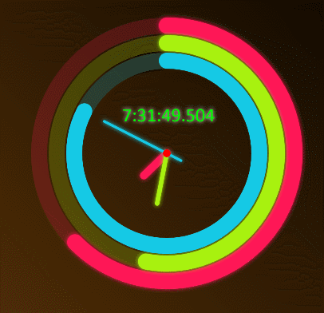