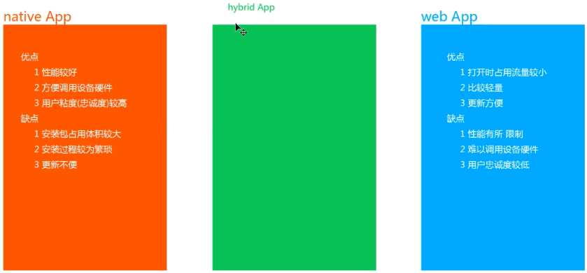
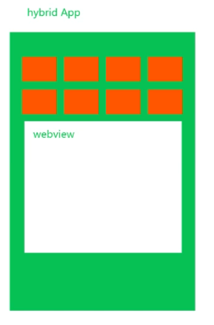
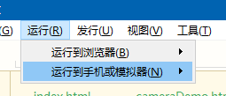
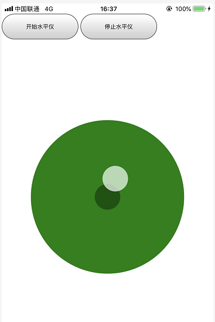
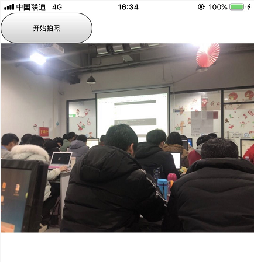
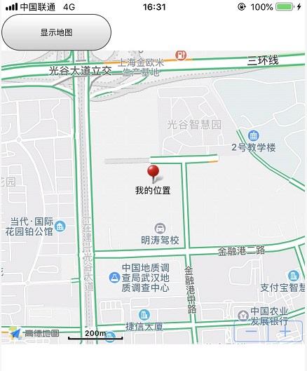

## 一、混合开发Hybrid

移动端UI一般分为：

原生app：native App

网页app：web app


Hybrid App是指介于web-app、native-app这两者之间的app,它虽然看上去是一个Native App，但只有一个UI WebView，里面访问的是一个Web App。







hybrid开发app一般遵循：

对于不经常改变视图的使用native APP开发，经常改变的使用 web APP，就综合了native APP和web App的优点。


### 1、安装环境

这里使用HbuilderX集成的H5+开发hybrid app。

下载安装HbuilderX之后，在运行里面安装手机运行的插件：




然后我们开发的H5+程序才可以在手机运行。

环境搭建好后，新建H5+APP项目，在index.html中编写代码即可。

H5+的API文档参考：https://www.html5plus.org/doc/zh_cn/accelerometer.html


新建的项目中有个

```js
document.addEventListener('plusready', function() {}
```

这个是hbuilder为hybrid开发准备的，只有在hybrid开发中才会有这个事件。所有对移动端事件的api调用，均在该事件触发后，通过`plus.`的形式进行调用。 

**这有点类似hbuilder为hybrid开发而开发的一套框架，便于我们调用设备底层信息。**


### 2、示例：水平仪

```html
<!DOCTYPE html>
<html>
	<head>
		<meta charset="utf-8">
		<meta name="viewport" content="initial-scale=1.0, maximum-scale=1.0, user-scalable=no" />
		<title></title>
		<style type="text/css">
			* {
				margin: 0;
				padding: 0;
			}
			
			button {
				width: 150px;
				height: 50px;
			}
			
			.acc {
				width: 300px;
				height: 300px;
				border-radius: 50%;
				background-color: green;
				position: fixed;
				top: 50%;
				left: 50%;
				transform: translate(-50%, -50%);
			}
			
			.acc:before {
				content: '';
				display: block;
				width: 50px;
				height: 50px;
				background-color: rgba(0,0,0,0.35);
				border-radius: 50%;
				position: absolute;
				top: 50%;
				left: 50%;
				transform: translate(-50%, -50%);
			}
			
			.point {
				width: 50px;
				height: 50px;
				background-color: rgba(255,255,255,0.7);
				border-radius: 50%;
				position: absolute;
				top: 50%;
				left: 50%;
				margin-left: -25px;
				margin-top:-25px;
				transition: all 100ms;
			}
		</style>
	</head>
	<body>
		<button id="startAcc">开始水平仪</button>
		<button id="stopAcc">停止水平仪</button>
		
		<div class="acc">
			<div class="point" id="point"></div>
		</div>
	</body>
	<script type="text/javascript">
		let startAcc = document.getElementById('startAcc');
		let stopAcc = document.getElementById('stopAcc');
		let point = document.getElementById('point');
		
		var wid = 0;

		document.addEventListener('plusready', function() {
			//console.log("所有plus api都应该在此事件发生后调用，否则会出现plus is undefined。"

			startAcc.onclick = function() { 
				// 获取手机重力传感器的值
// 				plus.accelerometer.getCurrentAcceleration(info => {
// 					console.log(`x轴重力传感器的值: ${info.xAxis}`);
// 					console.log(`y轴重力传感器的值: ${info.yAxis}`);
// 					console.log(`z轴重力传感器的值: ${info.zAxis}`);
// 				}, e => {
// 					alert( "Acceleration error: " + e.message ); 
// 				});
				
				
				
				// 监听重力加速度
// 				wid = plus.accelerometer.watchAcceleration(info => {
// 					console.log(`x轴重力传感器的值: ${info.xAxis}`);
// 					console.log(`y轴重力传感器的值: ${info.yAxis}`);
// 					console.log(`z轴重力传感器的值: ${info.zAxis}`);
// 				}, e => {
// 					alert( "Acceleration error: " + e.message ); 
// 				},{frequency:1000});


				// 监听水平仪
				wid = plus.accelerometer.watchAcceleration(info => {
// 					console.log(`x轴重力传感器的值: ${info.xAxis}`);
// 					console.log(`y轴重力传感器的值: ${info.yAxis}`);
// 					console.log(`z轴重力传感器的值: ${info.zAxis}`);
					let x = 12.7551 * info.xAxis; // 小球x方向移动的最大范围 150-25 / 9.8 = x / info.xAxis
					let y = -12.7551 * info.yAxis;
					point.style.transform = `translate(${x}px, ${y}px)`;
					
					if(Math.abs(x) < 2 && Math.abs(y) < 2) {
						point.style.background = 'rgba(255,0,0,0.7)';
					} else {
						point.style.background = 'rgba(255,255,255,0.7)';
					}
				}, e => {
					alert( "Acceleration error: " + e.message ); 
				},{frequency:100});				
			}
			
			stopAcc.onclick = function() {
				plus.accelerometer.clearWatch( wid );
			}

		});
	</script>
</html>

```




### 3、示例：照相机

```html
<!DOCTYPE html>
<html>
	<head>
		<meta charset="utf-8">
		<meta name="viewport" content="initial-scale=1.0, maximum-scale=1.0, user-scalable=no" />
		<title></title>
		<style type="text/css">
			* {
				margin: 0;
				padding: 0;
			}
			
			button {
				width: 150px;
				height: 50px;
			}
			
			img {
				width: 100%;
				height: auto;
				display: block;
			}
			
			
		</style>
	</head>
	<body>
		<button id="start">开始拍照</button>
		<!-- <button id="stop">停止水平仪</button> -->
		
		

	</body>
	<script type="text/javascript">
		let start = document.getElementById('start');
		let stop = document.getElementById('stop');
		
		let img = document.getElementById('img');

		document.addEventListener('plusready', function() {
			start.addEventListener('click', function() {
				let cam = plus.camera.getCamera(); // 获取主摄像头
				
				cam.captureImage(path=>{
					// path是手机本地相对路径
					// convertLocalFileSystemURL: 将本地URL路径转换成平台绝对路径
					img.src = plus.io.convertLocalFileSystemURL(path);
				}, err=>{
					console.log('拍照失败！');
				});
			})
			
		});
	</script>
</html>

```




### 4、示例：地图

```html
<!DOCTYPE html>
<html>
	<head>
		<meta charset="utf-8">
		<meta name="viewport" content="initial-scale=1.0, maximum-scale=1.0, user-scalable=no" />
		<title></title>
		<style type="text/css">
			* {
				margin: 0;
				padding: 0;
			}

			button {
				width: 150px;
				height: 50px;
			}

			#area {
				width: 100%;
				height: 400px;
			}
		</style>
	</head>
	<body>
		<button id="start">显示地图</button>
		<!-- <button id="stop">停止水平仪</button> -->

		<div id="area"></div>

	</body>
	<script type="text/javascript">
		let start = document.getElementById('start');

		let area = document.getElementById('area');

		document.addEventListener('plusready', function() {
			start.addEventListener('click', function() {
				// 获取当前位置经纬度
				// longitude:经度 latitude:纬度
				plus.geolocation.getCurrentPosition(position => {
					// 创建Point对象
					var ptObj = new plus.maps.Point(position.coords.longitude, position.coords.latitude);
					
					// 创建地图空间对象
					var mapObj = new plus.maps.Map('area', {
						// 地图中心位置
						center: ptObj,
						// 地图缩放级别
						zoom: 16,
						// 显示缩放控件
						zoomControls: true,
						// 地图的视图类型 
						// MAPTYPE_NORMAL:普通街道地图
						// MAPTYPE_SATELLITE: 卫星视图
						type: plus.maps.MapType.MAPTYPE_NORMAL,
						// 地图的是否显示交通信息
						traffic: true,
					});
					
					// 创建气泡标点
					var marker = new plus.maps.Marker( ptObj );
					marker.setLabel("我的位置");
					var bubble = new plus.maps.Bubble("点击标点显示的内容");
					marker.setBubble(bubble);
					// 将标点加到地图上
					mapObj.addOverlay(marker);
				});
			})

		});
	</script>
</html>

```

