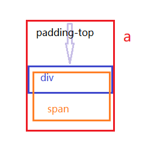

20181017 如何实现如下功能


这个首页链接，鼠标放上去的时候，可以上下翻动怎么做呢？


**设计思路：**

- li标签里面是一个a；
- a里面是个div；
- div里面是个span；
- span里面是“首页”和p标签“HOME”。




**实现思路：**

- 首先设置宽度，但是不用设置高度，高度由a撑开；
- 设置a的高度，这时候文字“首页“是在顶部的，可以设置padding-top的值往下直到”首页“到达中间；（此时header的高度为a的高度+padding-top的高度）
- 设置div的高度为“首页“的高度，然后加上overflow:hidden;
- 当鼠标放在a上是，设置span的margin-top为负值，可以将字往上移动，最后加上过渡效果即可。


**实现代码：**

```html
<!DOCTYPE html>
<html>

<head>
    <meta charset="UTF-8">
    <title>Document</title>
    <link rel="stylesheet" href="./css/base.css">
    <style>
        header {
            width: 100%;
        }

        ul {
            width: 100%;
            background-color: #ff0;
            text-align: center;
        }

        ul li {
            display: inline-block;
            background-color: #f0f;
            margin: 0 20px;
        }

        li a {
            display: block;
            width: 100%;
            height: 50px;
            background-color: #0ff;
            padding-top: 28px;
        }

        li a div {
            width: 100%;
            height: 22px;
            overflow: hidden;
        }

        span {
            display: block;
        }

        li a:hover span {
            margin-top: -20px;
            transition: margin 0.5s;
        }
    </style>
</head>

<body>
    <header>
        <ul class="clearfix">
            <li>
                <a href="javascript:;">
                    <div>
                        <span>首页
                            <p>HOME</p>
                        </span>
                    </div>
                </a>
            </li>
        </ul>
    </header>
</body>

</html>
```

